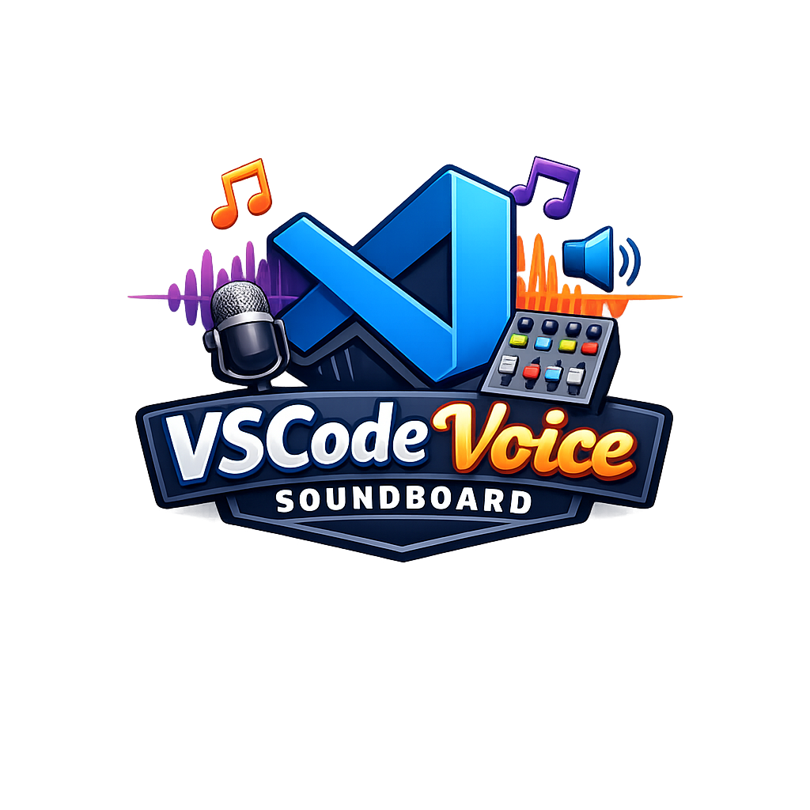

  <strong>English</strong> | <a href="README.ja.md">日本語</a> | <a href="README.zh.md">中文</a> | <a href="README.es.md">Español</a> | <a href="README.fr.md">Français</a> | <a href="README.hi.md">हिन्दी</a> | <a href="README.it.md">Italiano</a> | <a href="README.pt-BR.md">Português</a>

  

  
  
  
  

Estensione di sintesi vocale con 48 voci, impostazioni predefinite e dialogo multicanale, basata su [MCP Voice Soundboard](https://github.com/mcp-tool-shop-org/mcp-voice-soundboard).

## Caratteristiche

- **Pannello laterale** con le schede "Voce", "Voci" e "Dialogo".
- **48 voci** disponibili in 9 lingue (inglese, giapponese, cinese mandarino, spagnolo, francese, hindi, italiano, portoghese).
- **5 preset** – Assistente, Narratore, Annunciatore, Raccontastorie, Sussurro.
- **Dialogo multi-voce** – scrivete script, assegnate le voci e riproducete tutto.
- **Selezione della voce** – evidenziate il codice o il testo e premete `Ctrl+Shift+S`.
- Riproduzione audio **multipiattaforma** (Windows, macOS, Linux).

## Come iniziare

1. Installare l'estensione.
2. Il server di MCP Voice Soundboard si avvia automaticamente.
3. Cliccare sull'icona del microfono nella barra delle attività.
4. Digitare il testo e cliccare su **Parla**.

## Comandi

| Comando. | Scorciatoia. | Descrizione. |
| Certo, ecco la traduzione:

"Please provide the English text you would like me to translate into Italian." | Certainly. Please provide the English text you would like me to translate. I will do my best to provide an accurate and natural-sounding Italian translation. | Certo, ecco la traduzione:

"Please provide the English text you would like me to translate into Italian." |
| Tastiera vocale: pronuncia il testo... | — | Inserire il testo da pronunciare. |
| Pannello di controllo vocale: Selezione della voce. | `Ctrl+Shift+S` | Pronunciare il testo selezionato dall'editor. |
| Pannello di suoni vocali: Smetti di parlare. | — | Interrompere la riproduzione corrente. |
| Pannello di controllo vocale: Modifica la voce. | — | Selettore vocale rapido. |
| Pannello di controllo dei suoni: Attiva/Disattiva. | — | Mostra/nascondi la barra laterale. |
| Tastiera vocale: esportare i dialoghi in formato WebVTT. | — | Esportare lo script del dialogo come file di sottotitoli `.vtt`. |

## Esportazione dei dialoghi

Nella scheda "Dialogo", scriva una sceneggiatura con più interpreti, assegni le voci e quindi clicchi su **Esporta VTT**. L'estensione sintetizza ogni riga, calcola i timestamp cumulativi in base alla durata dell'audio e salva un file di sottotitoli in formato [WebVTT](https://developer.mozilla.org/en-US/docs/Web/API/WebVTT_API).

Il file `.vtt` esportato utilizza tag vocali (`<v Speaker>`) e può essere utilizzato con lettori video, editor di sottotitoli o strumenti di accessibilità.

## Impostazioni

| Ambientazione. | Predefinito. | Descrizione. |
| Certo, ecco la traduzione:

"Please provide the English text you would like me to translate into Italian." | Certo, ecco la traduzione:

"Please provide the English text you would like me to translate into Italian." | "Please provide the English text you would like me to translate." |
| `voiceSoundboard.defaultVoice` | `bm_george` | ID vocale predefinito. |
| `voiceSoundboard.speed` | `1.0` | Velocità del discorso (0,5–2,0). |
| `voiceSoundboard.backend` | `python` | Backend per la sintesi vocale (testo-voce), implementato in Python, utilizzando protocolli HTTP e con funzionalità di simulazione. |
| `voiceSoundboard.autoStart` | `true` | Avvia automaticamente il server all'attivazione. |
| `voiceSoundboard.format` | `wav` | Formato dell'uscita audio. |

## Licenza

MIT.
